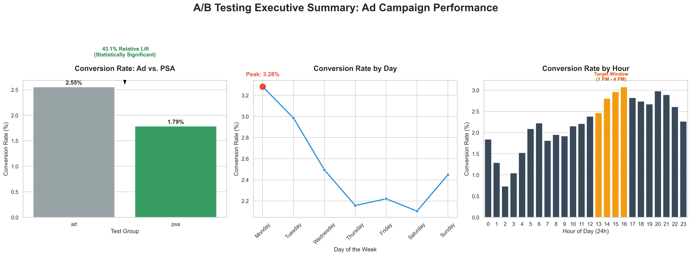

# Marketing A/B Testing: Ad Campaign Optimization

## Project Overview

This project analyzes an A/B test dataset (588K+ records) to evaluate the effectiveness of a new advertisement campaign. The goal was to determine if the new ad leads to significantly higher conversion rates compared to a control group (PSA).

## Key Business Insights

- **Significant Growth:** The Ad group achieved a **43.1% relative lift** in conversion rate.
- **Statistical Certainty:** Using a Z-test for proportions, the result is statistically significant (**p-value < 0.05**).
- **Time Optimization:** Monday was identified as the peak conversion day (3.28%), and 1 PM - 4 PM is the "Golden Window" for ad delivery.

## Tech Stack

- **Language:** Python
- **Libraries:** Pandas, Seaborn, Matplotlib, Statsmodels (for Z-test).

## Visual Summary

## Recommendation

Based on the analysis, I recommend **rolling out the new ad campaign** across all segments. To maximize ROI, the marketing budget should be prioritized on **Mondays** and during **afternoon hours (13:00 - 16:00)**.
